# Atividades
## 1. (FOR) Faça um código que exiba na tela uma contagem de 1 à 10.
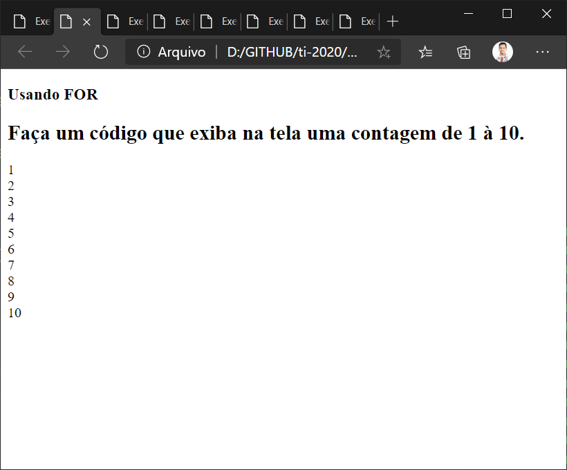

**EX-001.html**

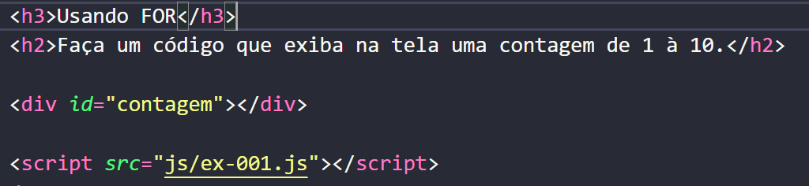

**EX-001.js**
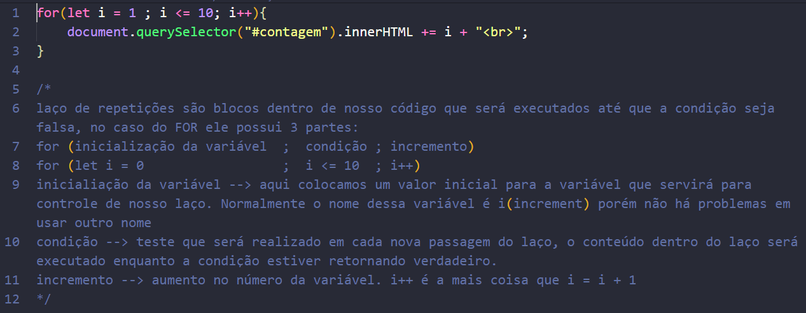

______

## 2. (WHILE) Faça um código que exiba na tela uma contagem de 1 à 10.
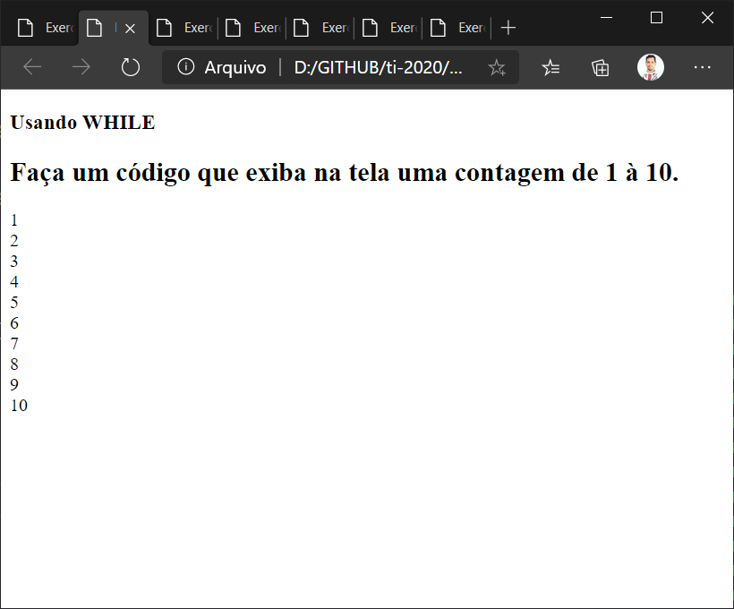

**EX-002.html**

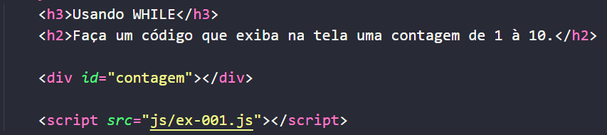

**EX-002.js**
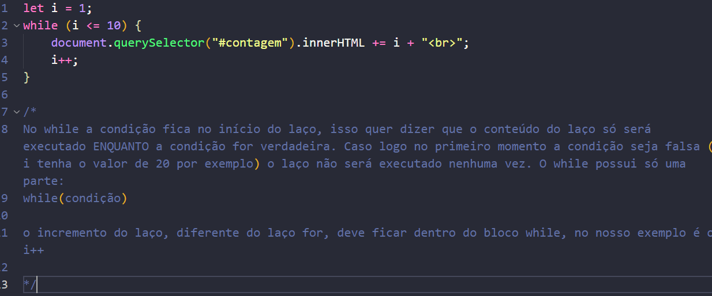

______

## 3. (DO...WHILE) Faça um código que exiba na tela uma contagem de 1 à 10.
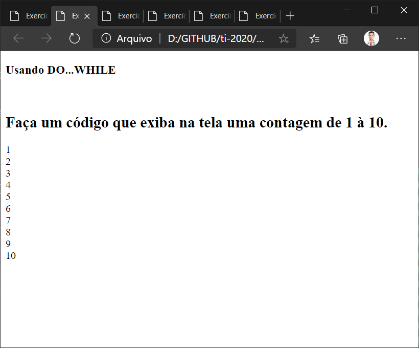

**EX-003.html**

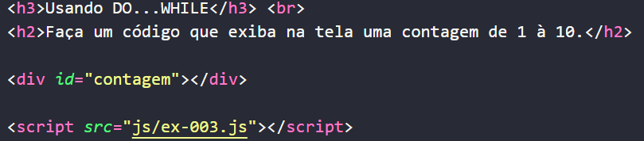

**EX-003.js**
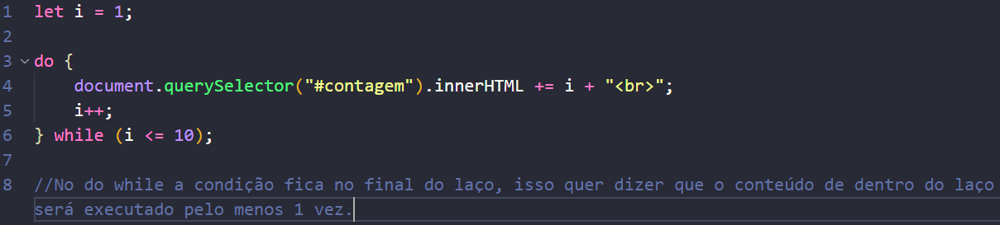

______

## 4. Faça um programa que imprima na tela os números de 1 a 20, um abaixo do outro. Depois modifique o programa para que ele mostre os números um ao lado do outro.

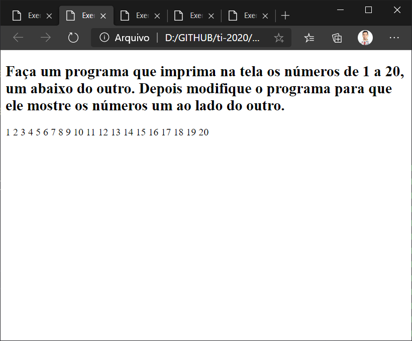

**EX-004.html**

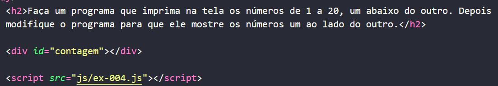

**EX-004.js**
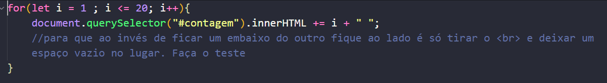

______

## 5. Faça um programa que imprima na tela apenas os números ímpares entre 1 e 50.

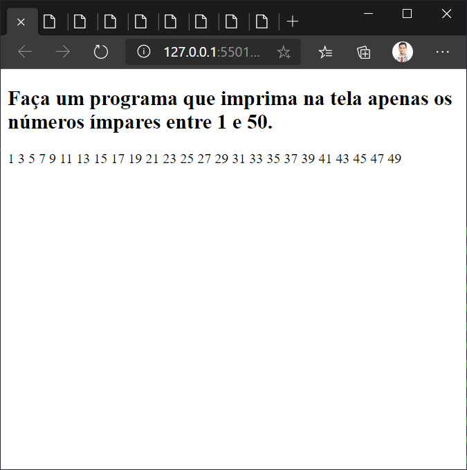

**EX-005.html**

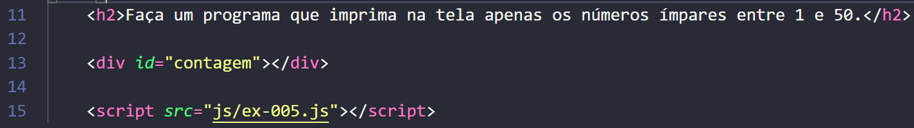

**EX-005.js**
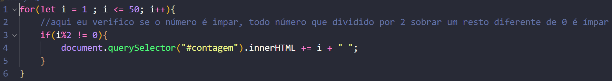

______

## 6. Faça um programa que receba dois números inteiros e gere os números inteiros que estão no intervalo compreendido por eles.

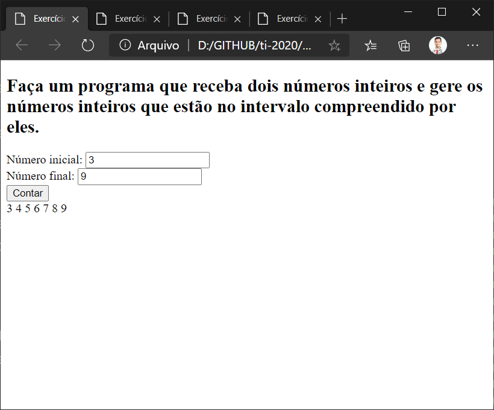

**EX-006.html**

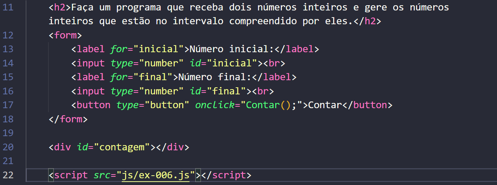

**EX-006.js**
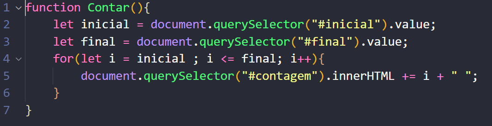

______

## 7. Desenvolva um gerador de tabuada, capaz de gerar a tabuada de qualquer número inteiro entre 1 a 10. O usuário deve informar de qual numero ele deseja ver a tabuada. A saída deve ser conforme o exemplo abaixo:

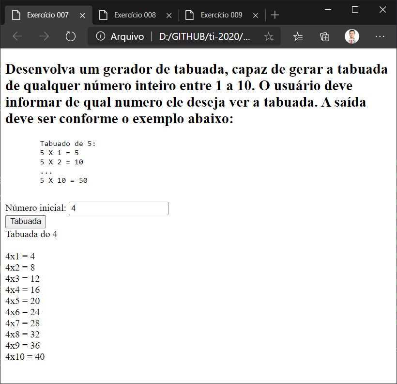

**EX-007.html**

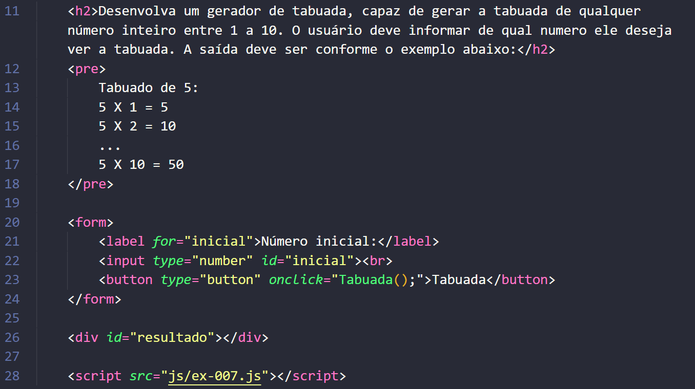

**EX-007.js**
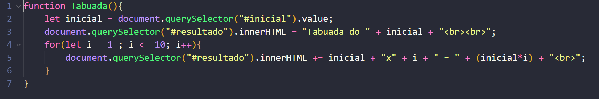

______

## 8. Faça um programa que calcule o número médio de alunos por turma para cada uma das 3 turmas que o professor possui. Para isto, peça a quantidade de alunos para cada turma. As turmas não podem ter mais de 40 alunos.

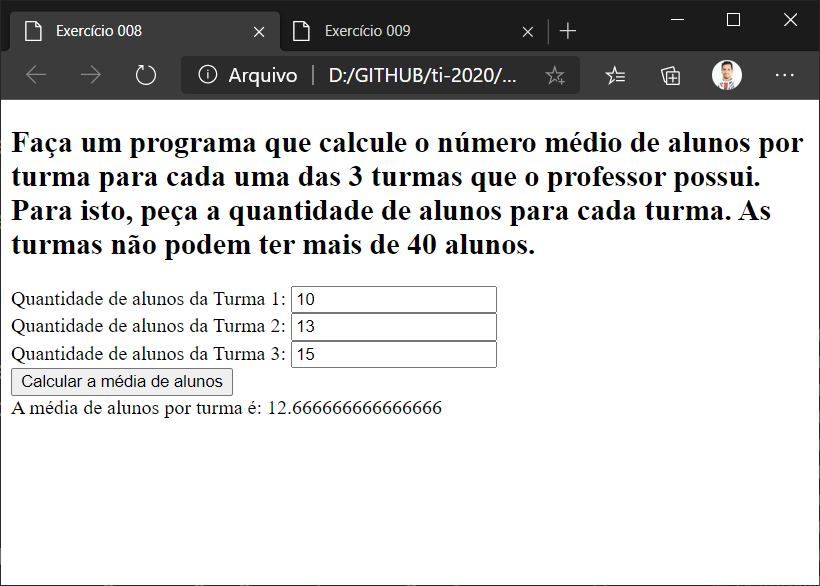

**EX-008.html**

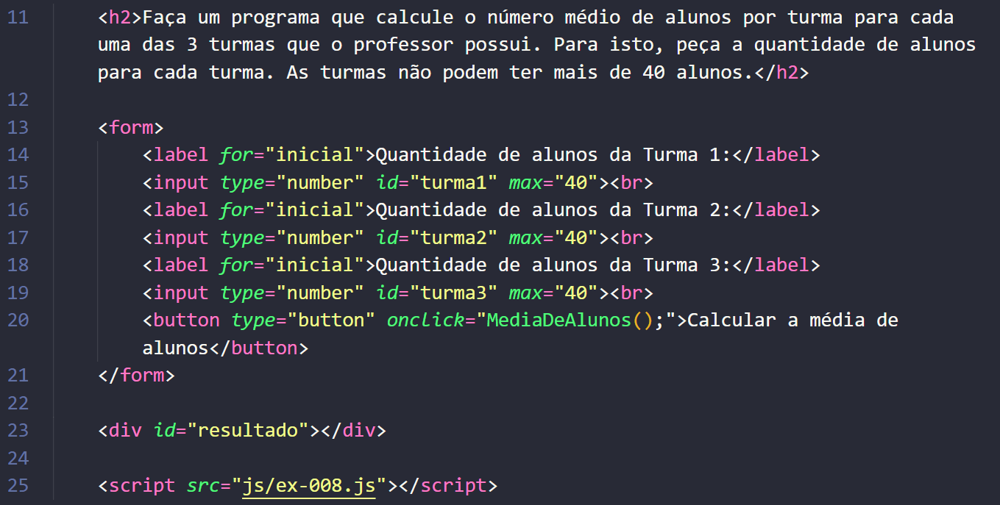

**EX-008.js**
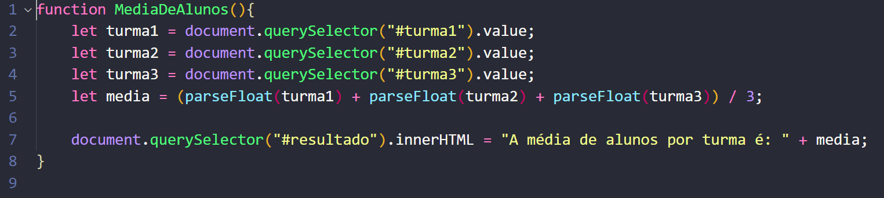

______

## 9. Faça um programa que calcule o número médio de alunos por turma. Para isto, peça a quantidade de turmas e a quantidade de alunos para cada turma. As turmas não podem ter mais de 40 alunos.

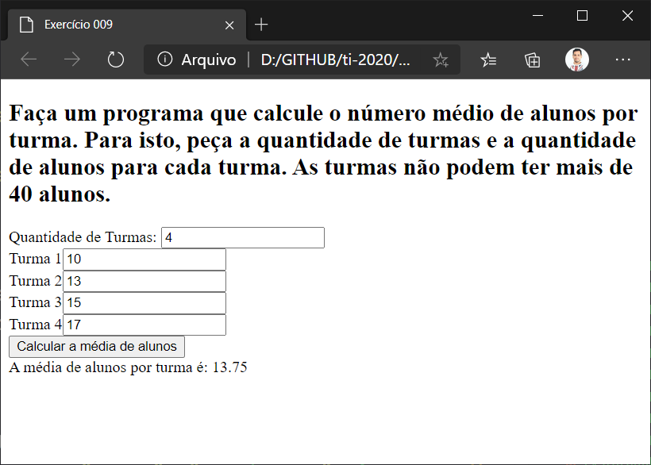

**EX-009.html**

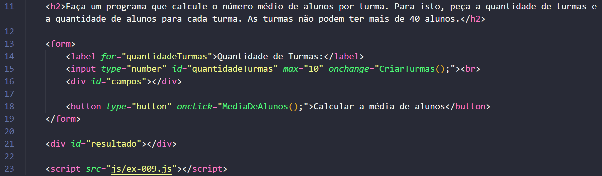

**EX-009.js**
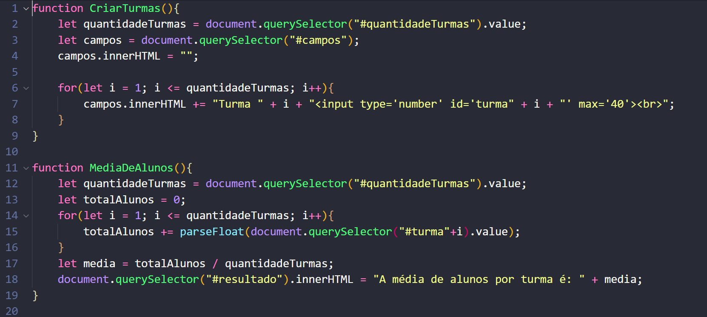

