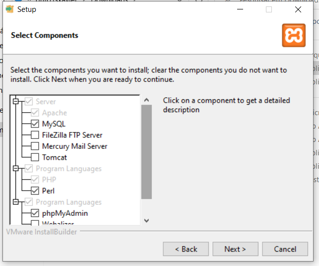

# PHP (Hypertext Preprocessor)
Uma linguagem server-side, roda do lado do servidor. É uma linguagem de programação back-end, pois ela realiza comunicação com banco de dados. 

Ela é processado no servidor e o resultado do processamento é enviado ao cliente(quem requisitou). Exemplo:

Arquivo PHP: 2+2

Resposta para o cliente: 4

Todo arquivo PHP terá a extensão .php

## Aula 01
 - Introdução ao PHP
 - Infraestrutura necessária
 - Onde colocar nossos arquivos
 - Variáveis
 - Tipos de dados
 - Operadores aritméticos

### Introdução ao PHP
- Documentação oficial http://php.net/
- Ele brilha na WEB, 79% da web usa PHP (https://kinsta.com/php-market-share/)
- PHP pode ser utilizado para projetos de IoT(internet das coisas), funciona para criar aplicações de linha de comando(modo texto), pode criar aplicativos desktop com PHP
- PHP é uma linguagem interpretada

### Infraestrutura necessária
- Servidor é computador que fornece serviços a clientes. Exemplo: Serviço de DHCP: O servidor fica responsável por distribuir números IP(Internet Protocol) para os clientes(hosts) na rede.
- Nossos sites ficam em servidores Web, um servidor web é responsável por exibir um site quando for solicitado(requisição). Iremos utilizar o servidor web chamado APACHE(existem outros como IIS, NGINX) juntamente com um banco de dados chamado MariaDB(mesma coisa do MySQL). 
- Vamos instalar o XAMPP, esse programa já instala o APACHE, o PHP e o MariaDB. Baixe o XAMPP em https://www.apachefriends.org/ . 

### Onde colocar nossos arquivos
- Os arquivos PHP precisam ser executados à partir do servidor, como se você estive acessando pela internet.
- Para o XAMPP, o local aonde devemos colocar os arquivos é em `c:\xampp\htdocs`. Exemplo: `c:\xampp\htdocs\site\index.php`
- Para executar os arquivos php, precisamos requisitá-los à partir do navegador digitando `http://localhost/`. Exemplo: `http://localhost/site/index.php`

### Variáveis
- Variável é um espaço na memória que damos um nome para armazenar algum valor.
- O PHP é case-sensitive, significa que ele diferencia maiúsculas de minúsculas, ou seja, Nome é diferente de nome.
- O nome de uma variável deve ser significativo de acordo com o seu valor. Exemplo: para uma variável que vai armazenar a idade de uma pessoa eu coloco o nome da variável de $idade. 
- No PHP toda variável inicia com $
- Não utilize caracteres especiais, espaços ou acentos para nome de variáveis. Alguns deles até funcionam, porém é recomendado escrever nomes de variáveis de forma simples. Exemplo: ao invés de endereço para o nome de uma variavel utilize $endereco sem o 'ç'.

### Tipos de dados
- Os valores em php podem ser divididos entre os tipos:
    - string: todo valor que estiver entre aspas é uma string, ou seja, um texto. Exemplo: 'Guto'
    - integer: todo número inteiro. Exemplo: 36
    - float ou double: todo número decimal. Exemplo: 1.75
    - boolean: valor de verdadeiro(true) ou falso(false)

### Operadores aritméticos
- + : adição
- - : operador de subtração
- *: operador de multiplicação
- /: operador de divisão
- **: exponenciação
- % : resto da divisão, operador de módulo