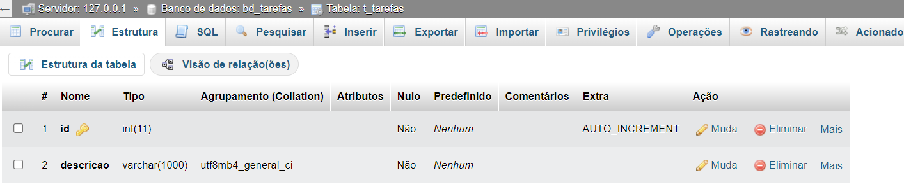

# Aula 12
> Criar uma aplicação para cadastro de tarefas.

## Conexão com banco de dados
Para uma conexão com o BD é necessário saber:
- endereço do servidor de banco de dados ( 127.0.0.1 ou localhost )
- nome do banco de dados ( bd_tarefas )
- usuário do banco de dados ( root )
- senha do banco de dados ( sem senha )

## Requisitos funcionais
### ToDO
A aplicação deve possibilitar:
- Lista de todas as tarefas
- Cadastrar uma nova tarefa
    - Redirecionar para a página inicial
    - Notificação da ação
- Alterar uma tarefa existente
    - Redirecionar para a página inicial
    - Notificação da ação
- Excluir uma tarefa existente
    - Redirecionar para a página inicial
    - Notificação da ação

- Adicionar nome do responsável pela tarefa
- Status da tarefa
- Consulta das tarefas por Status

### Backlog

- Data de início e fim da tarefa(previsto)
- Consulta por data
- Data de fim realizado
- Destaque nas tarefas que vencem no dia atual
- Modo de visualização de calendário

## Banco

